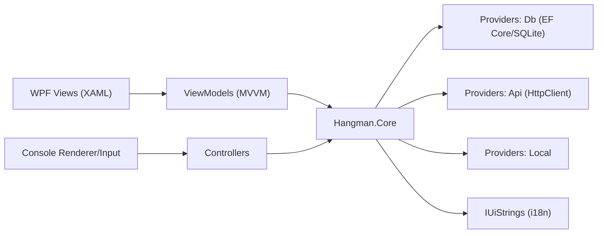
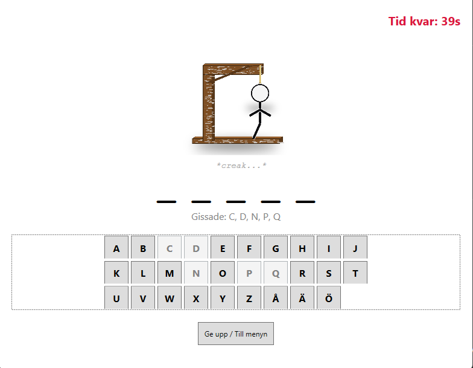
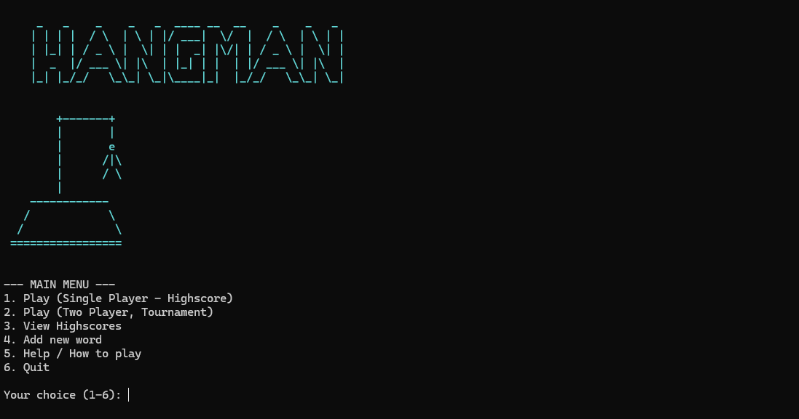

# 🎮 Hangman

[](https://dotnet.microsoft.com/)
[](#-arkitektur)
[](#-testning)

Ett avancerat C#-projekt byggt som ett komplett **Hänga Gubbe**-spel, med stöd för både **konsol** och ett grafiskt **WPF (MVVM)**-gränssnitt.  
Fokus: **Clean Architecture (Separation of Concerns)**, **MVVM**, **TDD**, **i18n**.

---

## Innehåll
- [Projektstruktur](#-projektstruktur)
- [Mappstruktur](#-mappstruktur)
- [Kom igång (Build & Run)](#-kom-igång-build--run)
  - [Förutsättningar](#förutsättningar)
  - [Köra via Visual Studio (rekommenderat)](#köra-via-visual-studio-rekommenderat)
  - [Köra via kommandoraden (dotnet-cli)](#köra-via-kommandoraden-dotnet-cli)
- [Databashantering](#-databashantering)
- [Funktioner](#-funktioner)
- [Arkitektur](#-arkitektur)
- [Avancerade C#-koncept som används](#-avancerade-c-koncept-som-används)
- [Testning](#-testning)
- [Skärmbilder](#-skärmbilder)
- [Tillgångar (Sprites & Bilder)](#-tillgångar-sprites--bilder)
- [Katalog över viktiga filer](#-katalog-över-viktiga-filer)

---

## 📁 Projektstruktur

Lösningen är uppdelad i fyra projekt för tydlig ansvarsfördelning:

| Projekt           | Typ            | Syfte                                                                 |
|-------------------|----------------|-----------------------------------------------------------------------|
| `Hangman.Core`    | Class Library  | Kärnlogik, spelregler, datamodeller, providers (ord/statistik), i18n.|
| `Hangman.Console` | Console App    | Det körbara konsol-baserade spelet.                                  |
| `Hangman.WPF`     | WPF App        | **GUI** byggt med **MVVM**.                                          |
| `HangmanTest`     | xUnit Tests    | Enhetstester för `Hangman.Core`.                                     |

---

## 🧱 Mappstruktur

```text
Hangman/
├─ Hangman.Core/
│  ├─ Game.cs                  # Kärnlogik för en spelrunda
│  ├─ TwoPlayerGame.cs         # Logik för turneringsläge (2-spelare)
│  ├─ Models/                  # Datamodeller (HighscoreEntry, CustomWordEntry, ...)
│  ├─ Providers/
│  │  ├─ Db/                   # EF Core (HangmanDbContext, SqliteHangmanService)
│  │  ├─ Api/                  # ApiWordProvider (externa ord via HttpClient)
│  │  └─ Local/                # Lokala/egna ordkällor
│  └─ Localizations/           # IUiStrings, SwedishUiStrings, EnglishUiStrings
│
├─ Hangman.Console/
│  ├─ Program.cs               # Entrypoint
│  ├─ GameController.cs        # Orkestrering / huvudloop
│  ├─ ConsoleInput.cs          # Inmatning
│  └─ ConsoleRenderer.cs       # Rendering
│
├─ Hangman.WPF/
│  ├─ App.xaml(.cs)            # Start, manuell DI & Localization
│  ├─ Views/                   # XAML-vyer (MainWindow, GameView, MenuView, ...)
│  └─ ViewModels/              # UI-logik (MainViewModel, GameViewModel, ...)
│
└─ HangmanTest/
   └─ GameTests.cs             # xUnit-tester för kärnlogiken
```

---

## 🚀 Kom igång (Build & Run)

### Förutsättningar
- **.NET 8 SDK** (målram: `net8.0`)
- **Windows** (krävs för WPF)
- **Visual Studio 2022** (rekommenderas) med workload **“.NET desktop development”**

### Köra via Visual Studio (rekommenderat)
1. Klona repot och öppna **`Hangman.sln`** i Visual Studio.
2. Välj startup-projekt:
   - **Konsol:** högerklicka `Hangman.Console` → **Set as Startup Project**
   - **WPF:** högerklicka `Hangman.WPF` → **Set as Startup Project**
3. Tryck **F5** (Start).

### Köra via kommandoraden (dotnet-cli)

**Konsol:**
```bash
cd Hangman/Hangman.Console
dotnet run
```

**WPF (Windows):**
```bash
cd Hangman/Hangman.WPF
dotnet run
```

---

## 🗄️ Databashantering

- Databasen **`Hangman.db`** skapas automatiskt vid första körning.  
- `HangmanDbContext` använder `Database.EnsureCreated()` och lägger filen i t.ex. `bin/Debug/net8.0/`.  
- Ingen manuell migrering krävs för att komma igång.

---

## ⚙️ Funktioner

- **Dubbla gränssnitt** – spela i **konsol** eller **WPF (MVVM)**.
- **Flerspråksstöd (i18n)** – växla **svenska/engelska** via `IUiStrings` (Strategy Pattern).
- **SQLite + EF Core 8** – highscores & egna ord sparas i `Hangman.db`.
- **Highscore-system** – lagrar “consecutive wins” per spelare/svårighetsgrad.
- **Anpassade ordlistor** – lägg till egna ord (sv/eng) via UI – lagras permanent.
- **Turneringsläge** – 2 spelare, 3 liv var.
- **Speltimer** – 60 sekunder per runda (single & tournament).
- **Asynkron ordhantering** – `IAsyncWordProvider` (API, DB, lokal).
- **API-integration** – hämtar engelska ord från externt API.
- **Ren konsolarkitektur** – `ConsoleInput`/`ConsoleRenderer` för SoC.

---

## 🧱 Arkitektur



- **MVVM (WPF)** – View (XAML) ↔ ViewModel (`INotifyPropertyChanged`, `ICommand`) ↔ Model (Core).
- **Clean Architecture** – `Hangman.Core` känner inte till UI-lagren.
- **Strategy Pattern** – för **ordkällor** (`IAsyncWordProvider`) och **lokalisering** (`IUiStrings`).
- **Manuell DI** – tjänster instansieras i `App.xaml.cs` (WPF) & `Program.cs` (Console).

---

## 🧩 Avancerade C#-koncept som används

| Område | Exempel i koden | Förklaring |
|---|---|---|
| Asynkron programmering | `async Task RunAsync()`, `await _wordProvider.GetWordAsync()` | Ordinhämtning, timers och UI-responsivitet (WPF) hanteras asynkront. I konsol används `Task.Run` + `CancellationTokenSource` för timer parallellt med input. |
| Data Binding (MVVM) | `INotifyPropertyChanged`, `ICommand` (t.ex. `RelayCommand`) | ViewModels meddelar UI om förändringar; knappar kopplas till kommandon – logik separeras från XAML. |
| Events & Delegates | `Game.GameEnded += OnGameEnded` | `Game.cs` signalerar win/lose och statusförändringar till UI-lagret. |
| Strategy Pattern | `IUiStrings`, `IAsyncWordProvider` | Utbytbara språk & ordkällor (API/DB/lokal) utan att ändra konsumenterna. |
| LINQ | `context.Highscores.OrderBy(...).Take(n)` | Effektiv hämtning/filtrering, särskilt i `SqliteHangmanService`. |
| Avancerade Collections | `HashSet<char>`, `ObservableCollection<T>` | O(1) gissningskontroll och automatisk UI-uppdatering av listor i WPF. |
| Anpassad felhantering | `NoCustomWordsFoundException` | Domänspecifika undantag översätts till användarvänliga, lokaliserade UI-meddelanden. |

---

## 🧪 Testning

- **Ramverk:** xUnit  
- **Plats:** `HangmanTest/GameTests.cs`

**Täckta scenarier:**
- Initiering av spel
- Rätt/fel gissningar & dubbelgissningar
- Vinst-/förlustvillkor
- Eventflöden
- Edge cases (tomma ord, specialtecken, case-insensitivity)

Kör tester:
```bash
dotnet test
```

---

## 🖼️ Skärmbilder

- **Hangman.WPF – GameViewWPF**  
  

- **Hangman.Console – ConsoleMenu**  
  

---

## 📚 Katalog över viktiga filer

<details>
<summary><strong>Hangman.Core</strong></summary>

- `Game.cs` – Spelregler och rundlogik  
- `TwoPlayerGame.cs` – Turneringsläge (2 spelare, livsystem)  
- `Providers/Db/` – `HangmanDbContext`, `SqliteHangmanService`  
- `Providers/Api/ApiWordProvider.cs` – Ord via `HttpClient`  
- `Localizations/` – `IUiStrings`, `SwedishUiStrings`, `EnglishUiStrings`
</details>

<details>
<summary><strong>Hangman.WPF</strong></summary>

- `App.xaml(.cs)` – Start, DI, språksättning  
- `Views/` – `MainWindow.xaml`, `GameView.xaml`, `MenuView.xaml`, ...  
- `ViewModels/` – `MainViewModel`, `GameViewModel`, `HighscoreViewModel`, ...
</details>

<details>
<summary><strong>Hangman.Console</strong></summary>

- `Program.cs` – Entrypoint  
- `GameController.cs` – Orkestrering  
- `ConsoleInput.cs` / `ConsoleRenderer.cs` – SoC för IO
</details>

---

AI-ASSISTANS OCH KODGENERERING
Delar av denna kodbas har skapats, refaktorerats eller assisterats med hjälp av stora språkmodeller (LLM) och AI-verktyg för att effektivisera utvecklingsprocessen och förbättra kodkvaliteten.

Verktyg som använts
ChatGPT (för utformning av komplexa algoritmer och dokumentation).
Gemini (för autokomplettering, boilerplate och tester).
Omfattning av AI-assistans
AI har huvudsakligen använts för:

Boilerplate-kod: Generering av standardstruktur och klassdefinitioner.
Algoritmiska lösningar: Förslag på effektiva implementeringar för standardproblem (t.ex. sortering, databasinteraktioner).
Dokumentation: Förbättring och generering av kommentarer och docstrings.
Mänsklig granskning
All AI-genererad kod har granskats, testats och validerats manuellt av en mänsklig utvecklare.
